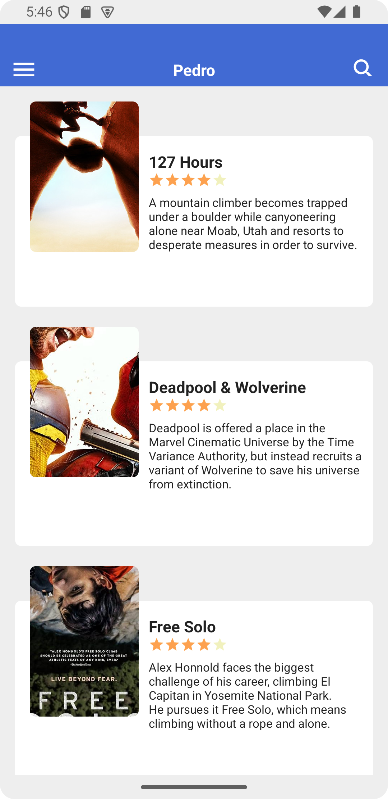
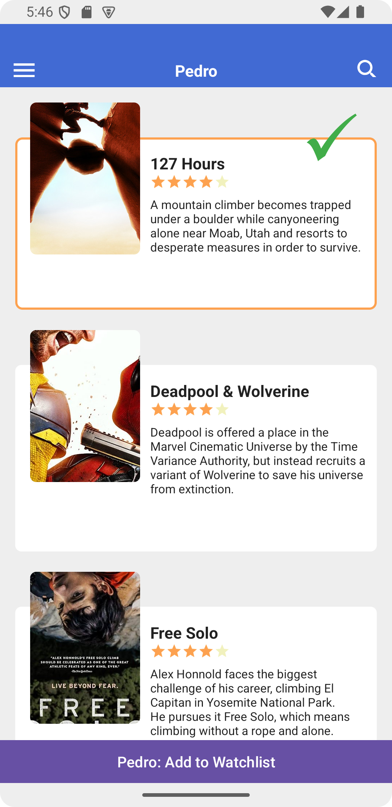
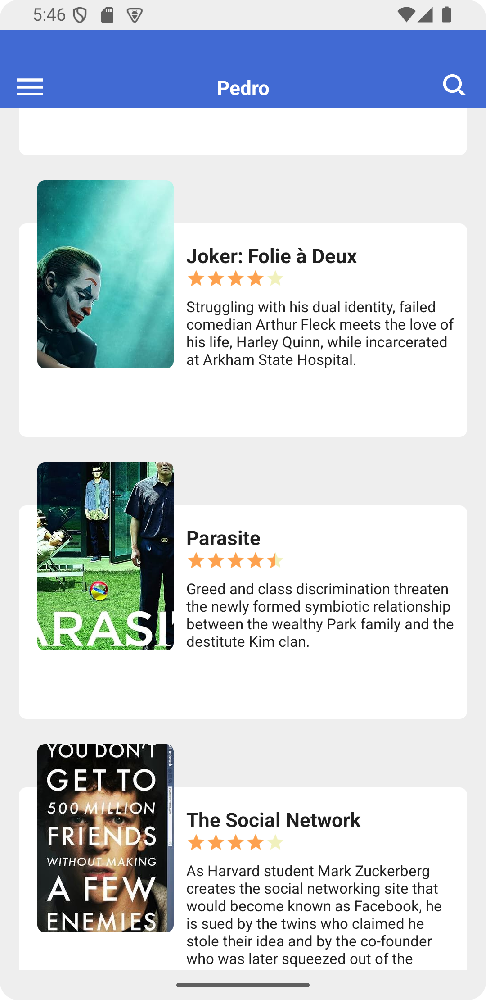
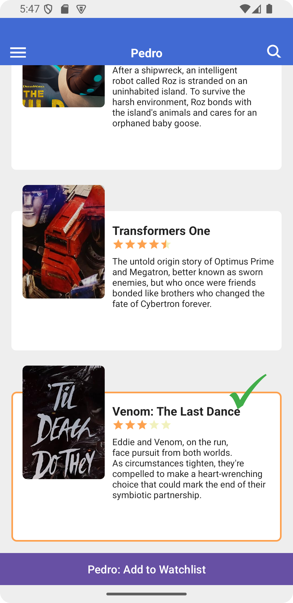
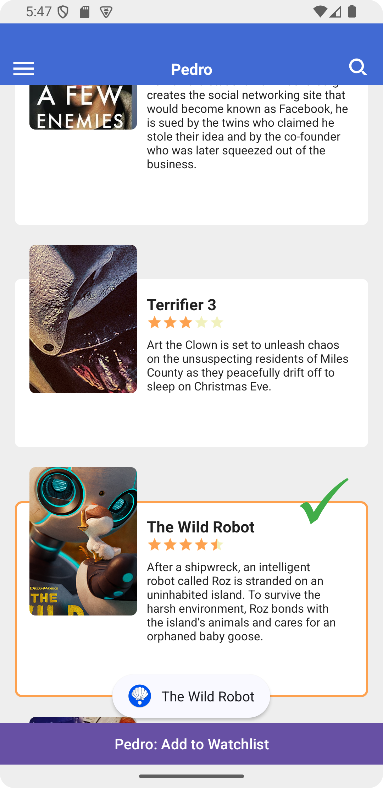

# Movie Poster App

## Overview
The Movie Poster App is an Android application that provides an interactive gallery of movie posters. Users can browse through a curated collection of upcoming and popular movies, select favorites, and add them to their watchlist. The app features a modern, intuitive interface with smooth scrolling and visual feedback for user interactions.

## Features
- **Dynamic Movie Poster Gallery**: Scroll through 10+ movie posters with smooth vertical swiping
- **Detailed Movie Information**: Each poster displays:
  - Movie poster image
  - Movie title
  - Director/Creator
  - Rating (using a 5-star system)
  - Plot synopsis
- **Interactive Selection**: 
  - Tap to select/deselect movie posters
  - Visual feedback for selected items
  - Dynamic watchlist button that appears when selections are made
- **Watchlist Management**:
  - Add selected movies to watchlist
  - Toast notifications for successful selections
- **Custom UI Elements**:
  - Primary color theme: #FF416AD3
  - Custom app icon
  - Header bar with navigation elements

## Technical Details
- **Platform**: Android
- **Language**: Java
- **Minimum SDK**: API 24 (Android 7.0 Nougat)
- **Target SDK**: API 34 (Android 14)
- **Compile SDK**: API 34
- **Development Environment**: 
  - Supports up to API 35 (Android 15 Preview)
  - Build Tools: 34.0.0

## Project Structure
```
app/
├── src/
│   ├── main/
│   │   ├── java/com/example/movieposter/
│   │   │   ├── MainActivity.java      # Main app entry point
│   │   │   ├── Poster.java           # Movie poster data model
│   │   │   ├── PosterAdapter.java    # RecyclerView adapter
│   │   │   └── PosterListener.java   # Selection event interface
│   │   └── res/
│   │       ├── drawable/
│   │       │   ├── checkmarka.png
│   │       │   ├── deadpoolwolverine.jpg
│   │       │   ├── freesolo.jpg
│   │       │   ├── ic_launcher_background.xml
│   │       │   ├── ic_launcher_foreground.xml
│   │       │   ├── ic_menu.xml
│   │       │   ├── ic_search.xml
│   │       │   ├── joker.jpg
│   │       │   ├── movie127hours.jpg
│   │       │   ├── parasite.jpg
│   │       │   ├── poster_background.xml
│   │       │   ├── poster_selected_background.xml
│   │       │   ├── socialnetwork.jpg
│   │       │   ├── terrifier3.jpg
│   │       │   ├── thewildrobot.jpg
│   │       │   ├── transformersone.jpg
│   │       │   └── venom.jpg
│   │       ├── layout/
│   │       │   ├── activity_main.xml
│   │       │   └── item_container.xml
│   │       └── values/
│   │           ├── colors.xml
│   │           ├── strings.xml
│   │           └── style.xml
└── build.gradle
```

## Key Components
- **MainActivity**: Main entry point of the app, handling poster list initialization and user interactions
- **Poster**: Data class representing movie information
- **PosterAdapter**: RecyclerView adapter managing poster display and selection
- **PosterListener**: Interface for handling poster selection events

## Screenshots

### Highlight custom image usage


### First Poster Selected


### No Poster Selected


### Last Poster Selected


### Watchlist Button Usage



## Installation
1. Clone the repository:
```bash
git clone https://github.com/tpedr0/CS460Lab3
```
2. Open the project in Android Studio
3. Build and run the application


## Documentation
The project includes comprehensive Javadoc documentation for all major components. Documentation can be found in the source code files:
- MainActivity.java
- Poster.java
- PosterAdapter.java
- PosterListener.java

## Movie Collection
The app includes a diverse selection of movies:
- 127 Hours
- Deadpool & Wolverine
- Free Solo
- Joker: Folie à Deux
- Parasite
- The Social Network
- Terrifier 3
- The Wild Robot
- Transformers One
- Venom: The Last Dance

## Future Enhancements
- Search functionality implementation
- User authentication
- Persistent watchlist storage
- Movie details expansion
- Trailer integration
- Social sharing features

## Credits
Created as part of CS460 at Central Washington University

## License
N/A

---
For any questions or support, please open an issue in the GitHub repository.
